# Let us walk on the 3-isogeny graph: efficient, fast, and simple

[](https://github.com/Crypto-TII/pqc-engineering-ssec-23/actions/workflows/cmake-multi-platform.yml)

Accompanying repository to the manuscript titled [“Let us walk on the 3-isogeny graph: efficient, fast, and simple”](https://eprint.iacr.org/2025/691).

## Table of contents
1. [Introduction](#section_01)  
2. [Setup Process](#section_02)
   1. [Build](#section_02_01)  
   2. [Testing](#section_02_02)
   3. [Benchmarking](#section_02_03)
3. [Reproducing the Manuscript Results](#section_03)
   1. [Figure 3: Benchmarks for the 2-isogenies vs. 3-isogenies walks](#section_03_01)
   2. [Figure 4: Benchmarks for the 3-isogenies walks (Our solution vs. QFESTA)](#section_03_02)
   3. [Figure 5 (a) and Figure 5 (b): Benchmarks for state-of-the-art dCTIDH vs. dCTIDH modified using our proposal.](#section_03_03)
4. [Source-Code Technical Documentation: Doxygen](#section_04)
5. [Integrated CI/CD: Build, Test, Benchmarking, and Reporting](#section_05)
6. [Additional Resources' Build Process](#section_06)
7. [Authors](#section_07)

<a name="section_01"></a>
## 1. Introduction

Our paper reached several important results:
- This work centers on improving HASH functions (CGL Function), KEMs (QFESTA) and NIKEs (CTIDH). 
- Our results help to propose friendly parameters for QFESTA, along with the first efficient implementation in C of the radical 3-isogenies. 
- Our results speedup the dCTIDH-2048  by a 4x factor, without any considerable change in the parameter sets and allowing a straightforward integration (just replacing small isogenies of degree 3,5,7,11 and 13 by the aforementioned radical 3-isogenies).

A video summarizing our ideas and contribution (in a general-reader level) is shown below:

<p align="center">
<a href="http://www.youtube.com/watch?feature=player_embedded&v=BjedMooSV30" target="_blank">
 
</a>
</p>

The YouTube link of our video is shown here: [Let us walk on the 3-isogeny graph: efficient, fast, and simple](https://www.youtube.com/watch?v=BjedMooSV30).

A general tree description of the source code of our project is shown below.

```
📁 pqc-engineering-ssec-23
├───📁 .github
├───📁 c-code
├───📁 dCTIDH
├───📁 docs
├───📁 gifs
├───📁 high-level-scripts
├───📁 obtained_statistics_examples
├───📁 reproduce_results
└───📄 README.md
```
In the following sections, we will cover in detail:
1. How to build, test, and benchmark,
2. How to replicate the results reported in the manuscript, 
3. How to generate the source code technical documentation using Doxygen, and
4. A real-life production CI/CD pipeline integration.

<a name="section_02"></a>
## 2. Setup Process

In this section we present a setup process that can be run in any Linux terminal. In case a specialized IDE like CLion is desired, please refer to [Let us walk on the 3-isogeny graph: CLion Setup](README_Clion_IDE.md).

<a name="section_02_01"></a>
### 2.1. Build

#### System requirements

Our (physical) testbed consists of machine with a 12th Gen. Intel(R) Core(TM) i9-12900H CPU and 32 Gb of RAM, running Ubuntu 20.04.6 LTS (64 bits), but any Linux environment running in an Intel CPU is enough.

Our project works in any out-of-the-box Linux-based environment with some basic software requirements:
- Cmake
- Python3 (numpy and matplotlib)

To check if your system counts with the required software, simply run 
```shell
cmake --version
python3 --version
pip list | grep numpy
pip list | grep matplotlib
```
If all the requirements are met, the terminal should return installed versions like the ones below.
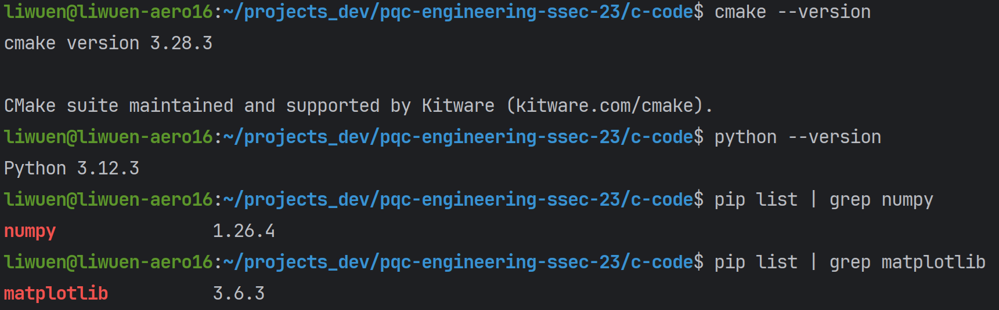

To build our project, in the root directory `pqc-engineering-ssec-23`, simply run
```shell
cd c-code
cmake -DCMAKE_BUILD_TYPE=Release -B cmake-build-release
cd cmake-build-release
make -j
```
This will create the `cmake-build-release` folder with all the tests for all the supported primes: `p254`, `p255`, `p381`, `p383`, `p398`, `p511`, `p575`, `p592`, `p765`, and `p783`. A list of the generated tests is shown below.


A demo of the whole process of setup and build process is shown below.

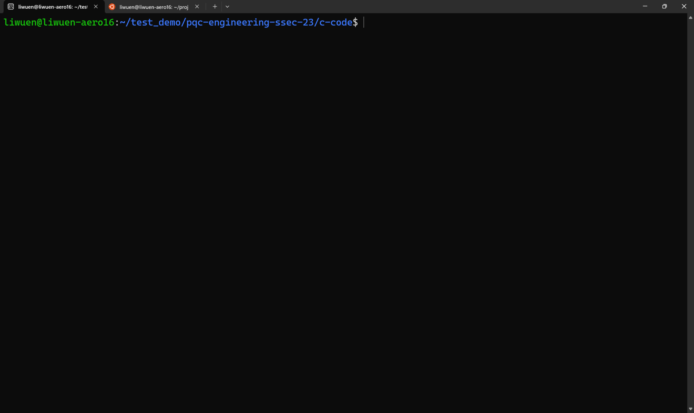


<a name="section_02_02"></a>
### 2.2. Testing

In this section, we show how to perform the **testing** of our source code. For a detailed explanation of each testing mode, please refer to our additional documentation: [Let us walk on the 3-isogeny graph: (Detailed) Build, Test and Benchmarking Framework Documentation](c-code/README.md).

After building as shown in the previous section, inside the `c-code/cmake-build-release` folder, locate all the possible tests with 
```shell
ls ./tests/
```
To execute any particular test, simply select one of the following 
```shell
./tests/tests-ssec-p254
./tests/tests-ssec-p255
./tests/tests-ssec-p381
./tests/tests-ssec-p383
./tests/tests-ssec-p398
./tests/tests-ssec-p511
./tests/tests-ssec-p575
./tests/tests-ssec-p592
./tests/tests-ssec-p765
./tests/tests-ssec-p783
```
For example, the execution of `./tests/tests-ssec-p254` is shown below.

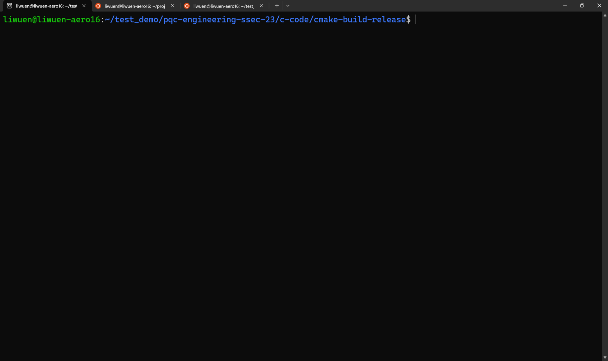

To run ALL the tests in verbose mode, simply run
```
ctest -V -R test
```

A demo of all the tests running in verbose mode is shown below.


<a name="section_02_03"></a>
### 2.3. Benchmarking

In this section, we show how to perform the **benchmarking** of our source code. For an explanation of how to perform the benchmarks in a detailed mode (and more insights about the used CPU benchmarking method), please refer to our additional documentation: [Let us walk on the 3-isogeny graph: (Detailed) Build, Test and Benchmarking Framework Documentation](c-code/README.md).

For benchmarking, the correct commands must be used when doing the first cmake. Inside the root directory `pqc-engineering-ssec-23`, simply run

```bash
pqc-engineering-ssec-23/c-code$ cmake -DCMAKE_BUILD_TYPE=Release -DBENCHMARKING=CYCLES -DARCHITECTURE=x8664 -B cmake-build-release-cycles-x8664
```
followed by
```bash
cd cmake-build-release-cycles-x8664
make -j
```

**NOTE:** Benchmarking does not work for
```bash
cmake -DCMAKE_BUILD_TYPE=Release -B cmake-build-release
cmake -DCMAKE_BUILD_TYPE=Debug -B cmake-build-debug
```
In case you run the benchmarking in either one of these two build modes (without the `-DBENCHMARKING` and the `-DARCHITECTURE` flags), you will get the following error:

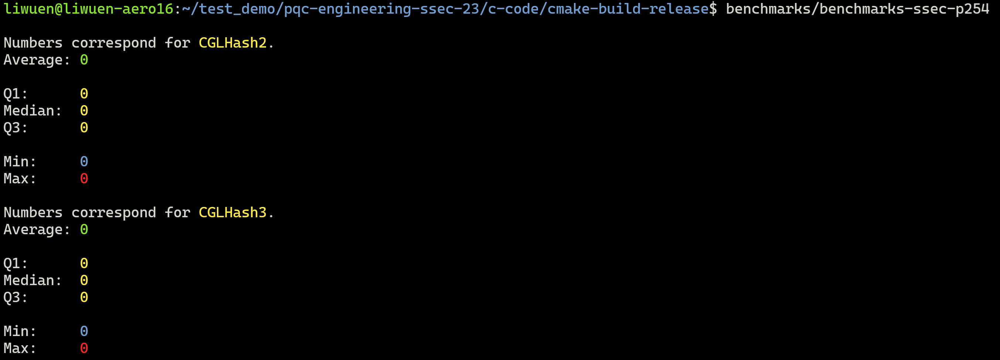

To execute any particular benchmarking, inside the `cmake-build-release-cycles-x8664` folder, simply select one of the following
```shell
benchmarks/benchmarks-ssec-p254
benchmarks/benchmarks-ssec-p255
benchmarks/benchmarks-ssec-p381
benchmarks/benchmarks-ssec-p383
benchmarks/benchmarks-ssec-p398
benchmarks/benchmarks-ssec-p511
benchmarks/benchmarks-ssec-p575
benchmarks/benchmarks-ssec-p592
benchmarks/benchmarks-ssec-p765
benchmarks/benchmarks-ssec-p783
```

A demo of successful benchmarkings is shown below.

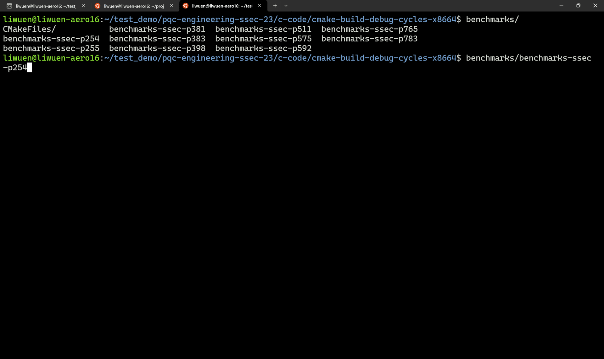

<a name="section_03"></a>
## 3. Reproducing the Manuscript Results

In our [manuscript](https://eprint.iacr.org/2025/691), several statistical figures are shown. In this section, we cover how to replicate the obtained graphs. In order to reproduce some of the figures in the manuscript, we provide with easy-to-use scripts that wrap all the required executions of the benchmarking tests, and by using `numpy` and `matplotlib`, generate the manuscript graphs.

The related code to reproduce our results is shown in the tree below.

```
📁 pqc-engineering-ssec-23
├───📁 c-code
├───📁 dCTIDH
├───📁 docs
├───📁 gifs
├───📁 high-level-scripts
├───📁 obtained_statistics_examples
├───📁 reproduce_results
│   ├───📁 manuscript_figure_03
│   │   ├───📄 benchmark_graph_03.py
│   │   └───📄 generate_figure_03.sh       # <= NEED TO EXECUTE
│   ├───📁 manuscript_figure_04
│   │   ├───📄 benchmark_graph_04.py
│   │   └───📄 generate_figure_04.sh       # <= NEED TO EXECUTE
│   └───📁 manuscript_figure_05
│       ├───📁 dCTIDH_benchmarks_output    # <= AUTOMATICALLY GENERATED!
│       ├───📁 dCTIDH_builds               # <= AUTOMATICALLY GENERATED!
│       ├───📁 statistics_output           # <= AUTOMATICALLY GENERATED!
│       ├───📄 analyze_bench.py
│       ├───📄 benchmark_graph_05.py
│       └───📄 generate_figure_05.sh       # <= NEED TO EXECUTE
└───📄 README.md
```

<a name="section_03_01"></a>
### 3.1. Figure 3: Benchmarks for the 2-isogenies vs. 3-isogenies walks

Inside the `reproduce_results/manuscript_figure_03` folder, it is necessary to give execution permissions to the script, via
```shell
chmod +x generate_figure_03.sh
```
Then, just simply execute it
```shell
./generate_figure_03.sh
```
This will automatically build with the `-DBENCHMARKING=CYCLES -DARCHITECTURE=x8664` flags, and perform all the statistics. At the end, a bar graph is automatically generated.

A demo of how to obtain the manuscript's Figure 03 is shown below.

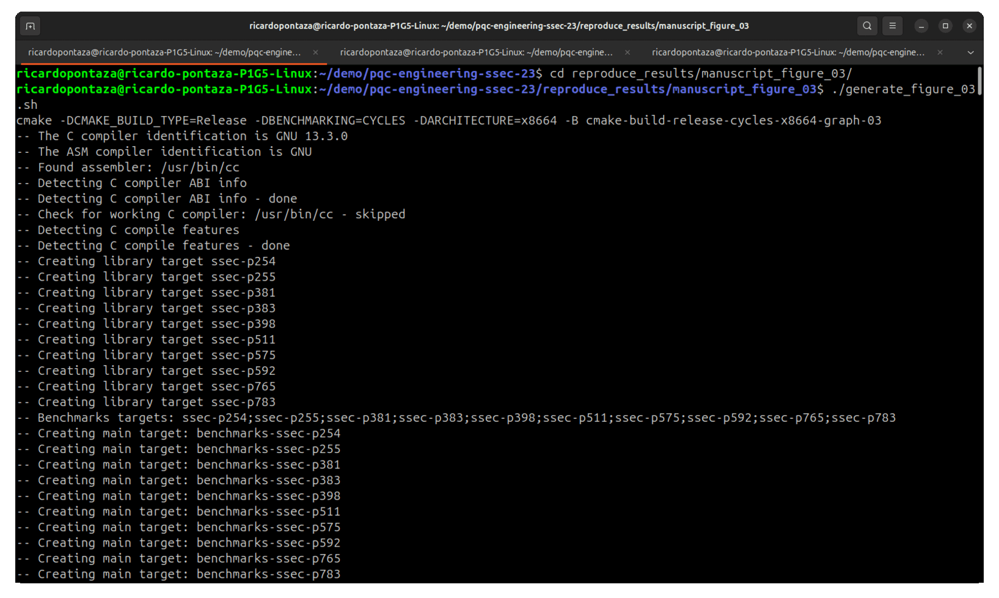

where the original Figure 3 presented in the manuscript is shown below.


<a name="section_03_02"></a>
### 3.2. Figure 4: Benchmarks for the 3-isogenies walks (Our solution vs. QFESTA)

Similar to the previous figure, inside the `reproduce_results/manuscript_figure_04` folder, it is necessary to give execution permissions to the script, via
```shell
chmod +x generate_figure_04.sh
```
Then, just simply execute it
```shell
./generate_figure_04.sh
```
This will automatically build with the `-DBENCHMARKING=CYCLES -DARCHITECTURE=x8664` flags, and perform all the statistics. At the end, a bar graph is automatically generated.

A demo of how to obtain the manuscript's Figure 03 is shown below.

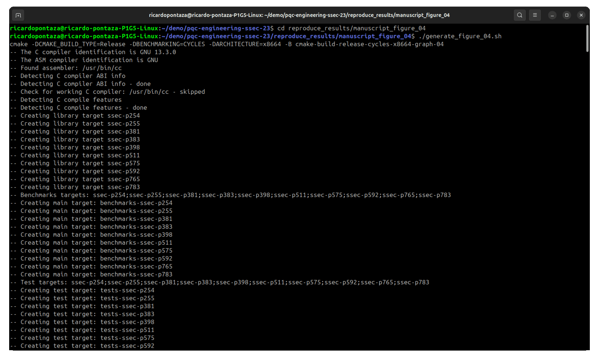

where the original Figure 4 presented in the manuscript is shown below.

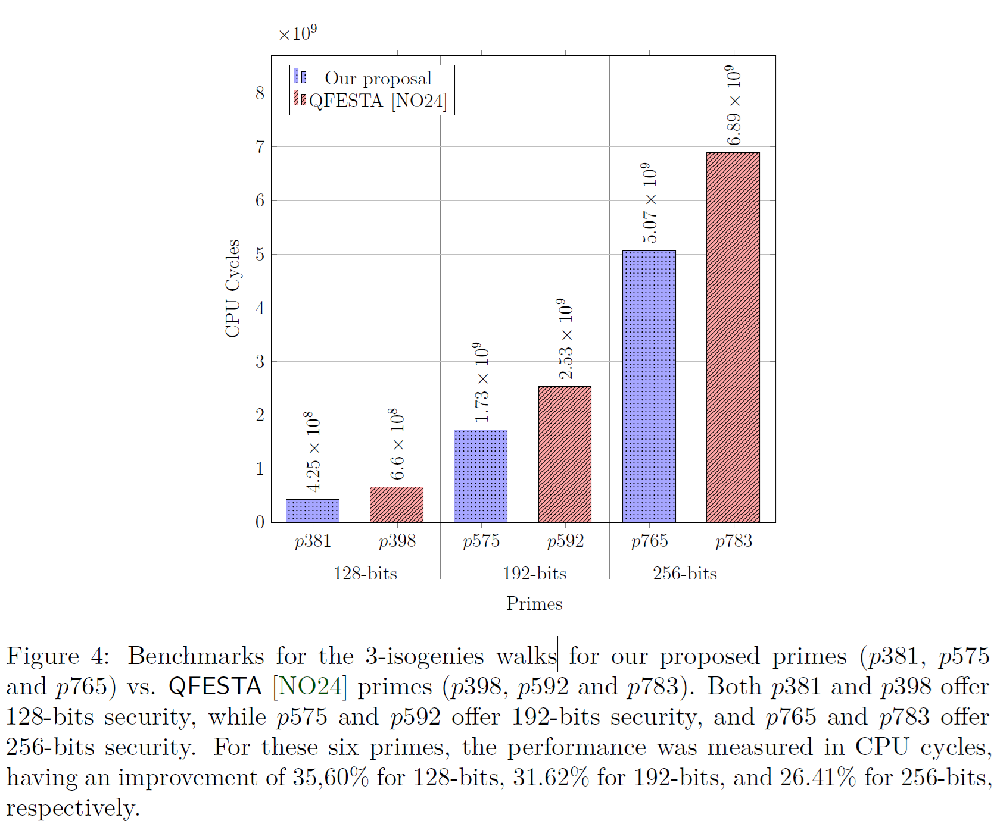


<a name="section_03_03"></a>
### 3.2. Figure 5 (a) and Figure 5 (b): Benchmarks for state-of-the-art dCTIDH vs. dCTIDH modified using our proposal.

Similar to the previous figures, inside the `reproduce_results/manuscript_figure_05` folder, it is necessary to give execution permissions to the script, via
```shell
chmod +x generate_figure_05.sh
```
Then, just simply execute it
```shell
./generate_figure_05.sh
```
This will automatically create three folders:
```
📁 manuscript_figure_05
├───📁 dCTIDH_benchmarks_output    # <= AUTOMATICALLY GENERATED!
├───📁 dCTIDH_builds               # <= AUTOMATICALLY GENERATED!
├───📁 statistics_output           # <= AUTOMATICALLY GENERATED!
├───📄 analyze_bench.py
├───📄 benchmark_graph_05.py
└───📄 generate_figure_05.sh       # <= NEED TO EXECUTE
```
The script will generate all the required folders to perform all the statistics. At the end, two line graphs are automatically generated. The first graph is the one associated to Figure 5 (a) in the manuscript, while the second graph is Figure 5 (b).

A demo of how to obtain the manuscript's Figure 05 is shown below.

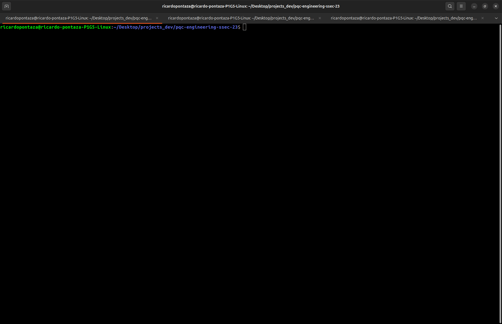

where the original Figure 5 presented in the manuscript is shown below.

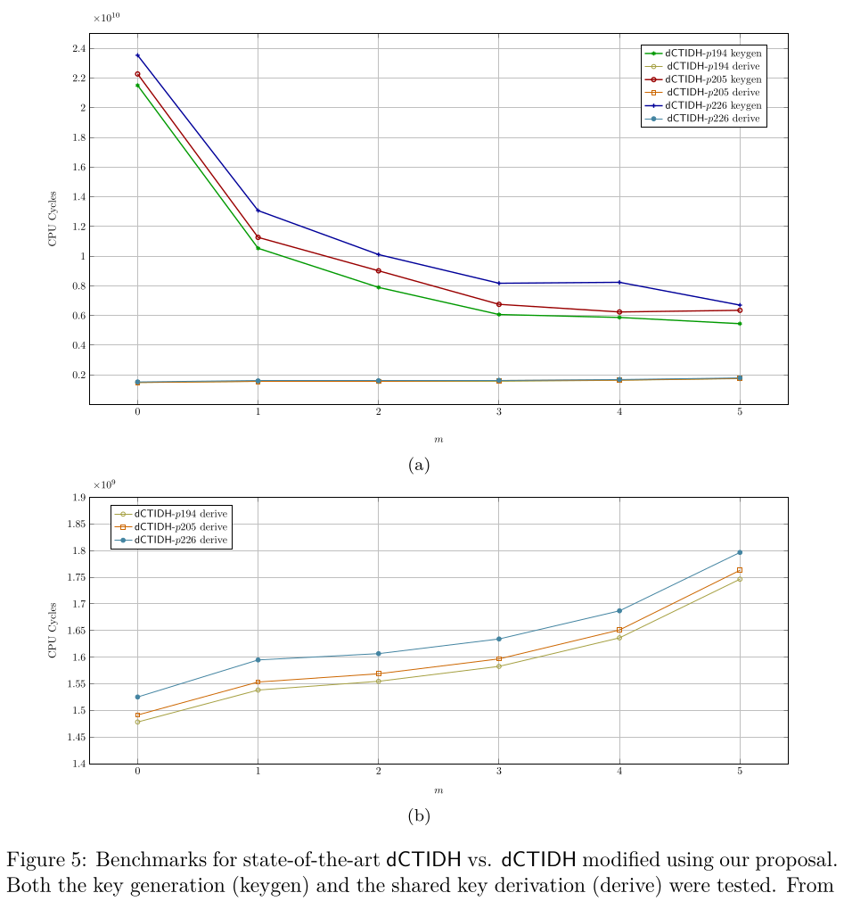


<a name="section_04"></a>
## 4. Source-Code Technical Documentation: Doxygen

Our project supports automatic technical documentation generation via Doxygen. To generate the Doxygen documentation, inside the `docs` folder, simply run
```bash
doxygen Doxyfile
```
This will generate an HTML site with interactive diagrams, and plenty of technical documentation. A demo of the generated documentation is shown below.

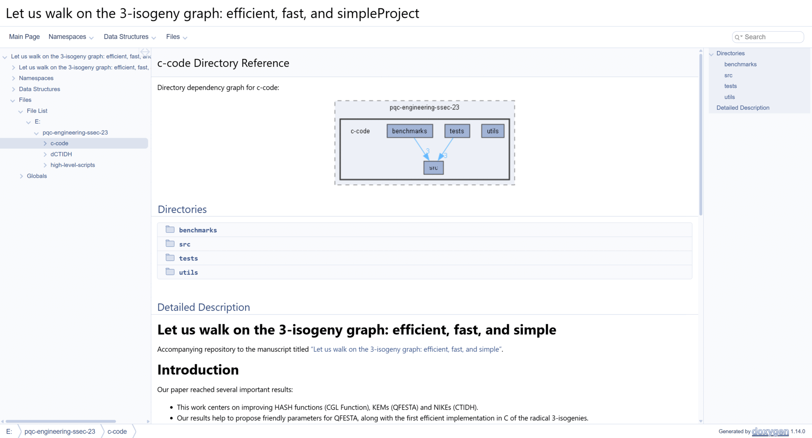

A link to a public-hosted version of our source-code documentation is shown here: [Let us walk on the 3-isogeny graph: Technical Documentation](https://crypto-tii.github.io/pqc-engineering-ssec-23/)

<a name="section_05"></a>
## 5. Integrated CI/CD: Build, Test, Benchmarking, and Reporting

To prove that this project can be integrated in an industrial environment where Continuous Integration (CI) and Continuous Delivery (CD), we follow a classic CI/CD workflow of (1) Build, (2) Test, (3) Benchmark, and (4) Reporting.

<p align="center">
  
</p>

To provide CI/CD related capabilities, in our source code we provide a [cmake-multi-platform.yml](.github/workflows/cmake-multi-platform.yml) file that uses **Docker images** to build, test and benchmark our solution. This is done to prove that our code and contribution can be integrated in a pipeline and be delivered as a part of a cryptographic solution in an industrial scenario.

<p align="center">
  
</p>

At the end of the Benchmark stage, the Reporting stage generates the three graphs presented in the manuscript (See [Section 3: Reproducing the Manuscript Results](#section_03)). All three generated graphs and all the benchmarking results (per prime) are uploaded as artifacts in the pipeline. In the figure below:
- The benchmark statistics are uploaded in the artifacts marked in **blue**, and
- The generated manuscript graphs are uploaded in the artifacts marked in **red**.
All the statistical data and all the graphs are uploaded as public artifacts to provide means to the reader to replicate our results. 

<p align="center">
  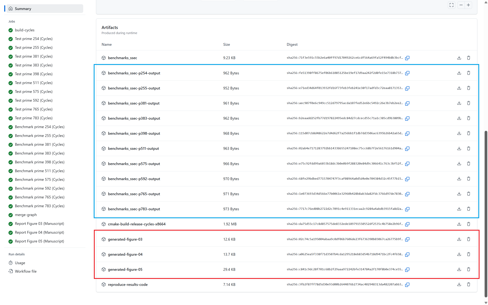
</p>

<a name="section_06"></a>
## 6. Additional Resources' Build Process

As mentioned before, for a detailed explanation of our testing and benchmarking frameworks (with insights of the CPU benchmarking approach), please refer to our additional documentation: [Let us walk on the 3-isogeny graph: (Detailed) Build, Test and Benchmarking Framework Documentation](c-code/README.md).

As part of our experiments, we used the a modified version of `dCTIDH`. To build the modified `dCTIDH`, please refer to [Let us walk on the 3-isogeny graph: dCTIDH modified version](dCTIDH/README.md).

<a name="section_07"></a>
## 7. Authors

For further information, please feel free to contact any of the authors:
<p align="center">
    <a href="mailto:jesus.dominguez@tii.ae"><strong>Jesús-Javier Chi-Domínguez</strong></a>,
    <a href="mailto:eduardo.ochoa@tii.ae"><strong>Eduardo Ochoa-Jiménez</strong></a>,
    <a href="mailto:ricardo.pontaza@tii.ae"><strong>Ricardo-Neftalí Pontaza-Rodas</strong></a>.
</p>
