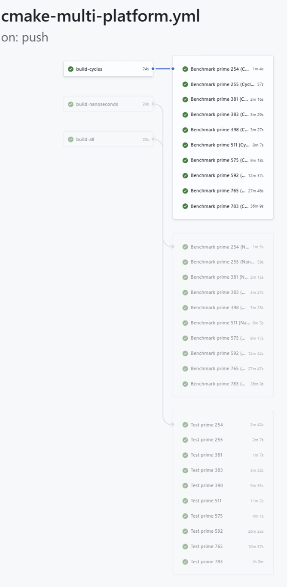

# Let us walk on the 3-isogeny graph: efficient, fast, and simple

Accompanying repository to the manuscript titled [“Let us walk on the 3-isogeny graph: efficient, fast, and simple”](https://eprint.iacr.org/2025/691).

## Setup Process

This project uses `cmake` and it has been configured to run with clion. A stand-alone `cmake` build can be done as well, but the instructions have to be run manually.

To set up the environment, in clion, create four different cmake profiles with the following instructions:

- Debug-cycles-x8664:
  - Build type: Use `Debug`.
  - Generator: Use `Unix Makefiles`.
  - CMake Options: Use `-G "Unix Makefiles" -DCMAKE_BUILD_TYPE=Debug -DBENCHMARKING=CYCLES -DARCHITECTURE=x8664`

- Release-cycles-x8664:
  - Build type: Use `Release`.
  - Generator: Use `Unix Makefiles`.
  - CMake Options: Use `-G "Unix Makefiles" -DCMAKE_BUILD_TYPE=Release -DBENCHMARKING=CYCLES -DARCHITECTURE=x8664`

- Debug-time-x8664:
  - Build type: Use `Debug`.
  - Generator: Use `Unix Makefiles`.
  - CMake Options: Use `-G "Unix Makefiles" -DCMAKE_BUILD_TYPE=Debug -DBENCHMARKING=TIME -DARCHITECTURE=x8664`

- Release-cycles-x8664:
  - Build type: Use `Release`.
  - Generator: Use `Unix Makefiles`.
  - CMake Options: Use `-G "Unix Makefiles" -DCMAKE_BUILD_TYPE=Release -DBENCHMARKING=TIME -DARCHITECTURE=x8664`

Please refer to the figure below for clarification.


## Doxygen

To generate the Doxygen documentation of the project, please run

```bash
pqc-engineering-ssec-23/docs$ doxygen Doxyfile
```

## Integrated CI/CD testing and benchmarking

To prove that this project can be integrated in an industrial environment where Continuous Integration (CI) and Continuous Delivery (CD) is important, we provide a [cmake-multi-platform.yml](.github/workflows/cmake-multi-platform.yml) file that uses docker images to build, test and benchmark our solution. This is done to prove that our code and contribution can be integrated in a pipeline and be delivered as a part of a cryptographic solution in an industrial scenario.

<p align="center">
  
</p>

## Detailed build process

Please refer to [c-code/README.md](https://github.com/Crypto-TII/pqc-engineering-ssec-23/blob/6f5033499375796b7aa919348278963818129299/c-code/README.md) for a detailed description of the build process of the c code. To build the modified dCTIDH, please refer to [README.md](dCTIDH/README.md).
