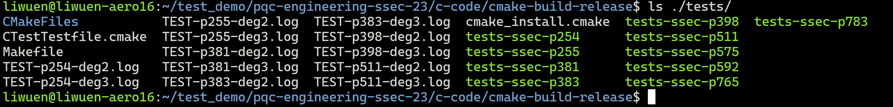

# Let us walk on the 3-isogeny graph: efficient, fast, and simple

Accompanying repository to the manuscript titled [“Let us walk on the 3-isogeny graph: efficient, fast, and simple”](https://eprint.iacr.org/2025/691).

## Table of contents
1. [Introduction](#section_01)  
2. [Setup Process](#section_02)  
   2.1. [IDE Setup: CLion](#section_02_01)  
   2.2. [General Terminal Setup](#section_02_02)
3. [Another paragraph](#paragraph2)


<a name="section_01"></a>
## 1. Introduction

Our paper reached several important results:
- This work centers on improving HASH functions (CGL Function), KEMs (QFESTA) and NIKEs (CTIDH). 
- Our results help to propose friendly parameters for QFESTA, along with the first efficient implementation in C of the radical 3-isogenies. 
- Our results speedup the dCTIDH-2048  by a 4x factor, without any considerable change in the parameter sets and allowing a straightforward integration (just replacing small isogenies of degree 3,5,7,11 and 13 by the aforementioned radical 3-isogenies).

A video summarizing our ideas and contribution (in a general-reader level) is shown below:

<a href="http://www.youtube.com/watch?feature=player_embedded&v=KhoViHztXpE" target="_blank">
 
</a>

The YouTube link of our video is shown here: [Let us walk on the 3-isogeny graph: efficient, fast, and simple](https://www.youtube.com/watch?v=KhoViHztXpE).

A general tree description of the source code of our project is shown below.

```
📁 pqc-engineering-ssec-23
├───📁 .github
├───📁 c-code
├───📁 dCTIDH
├───📁 docs
├───📁 gifs
├───📁 high-level-scripts
├───📁 obtained_statistics_examples
├───📁 reproduce_results
└───📄 README.md
```
In the following sections, we will cover in detail:
1. How to build, test, and benchmark,
2. How to replicate the results reported in the manuscript, 
3. How to generate the source code technical documentation using Doxygen, and
4. A real-life production CI/CD pipeline integration.

<a name="section_02"></a>
## 2. Setup Process

In case an IDE like CLion is desired, the instructions are shown below. **For a general terminal setup process, please skip to the following subsection: [General Terminal Setup](#section_02_02).**


<a name="section_02_01"></a>
### 2.1. IDE Setup: CLion

<details>
  <summary>Details</summary>

This project uses `cmake`. In case it is desired to use a specialized IDE like Clion, a stand-alone `cmake` build can be done as well, but the instructions have to be run manually.

To set up the environment, in clion, create four different cmake profiles with the following instructions:

- Debug-cycles-x8664:
  - Build type: Use `Debug`.
  - Generator: Use `Unix Makefiles`.
  - CMake Options: Use `-G "Unix Makefiles" -DCMAKE_BUILD_TYPE=Debug -DBENCHMARKING=CYCLES -DARCHITECTURE=x8664`

- Release-cycles-x8664:
  - Build type: Use `Release`.
  - Generator: Use `Unix Makefiles`.
  - CMake Options: Use `-G "Unix Makefiles" -DCMAKE_BUILD_TYPE=Release -DBENCHMARKING=CYCLES -DARCHITECTURE=x8664`

- Debug-time-x8664:
  - Build type: Use `Debug`.
  - Generator: Use `Unix Makefiles`.
  - CMake Options: Use `-G "Unix Makefiles" -DCMAKE_BUILD_TYPE=Debug -DBENCHMARKING=TIME -DARCHITECTURE=x8664`

- Release-cycles-x8664:
  - Build type: Use `Release`.
  - Generator: Use `Unix Makefiles`.
  - CMake Options: Use `-G "Unix Makefiles" -DCMAKE_BUILD_TYPE=Release -DBENCHMARKING=TIME -DARCHITECTURE=x8664`

Please refer to the figure below for clarification.


</details>

<a name="section_02_02"></a>
### 2.2. General Terminal Setup

#### 2.2.1. Build

Our project works out-of-the-box in any Linux-based environment with some basic software requirements:
- Cmake
- Python3 (numpy)

To check if your system counts with the required software, simply run 
```shell
cmake --version
python3 --version
```

To build our project, in the root directory `pqc-engineering-ssec-23`, simply run
```shell
cd c-code
cmake -DCMAKE_BUILD_TYPE=Release -B cmake-build-release
cd cmake-build-release
make -j
```
This will create the `cmake-build-release` folder with all the tests for all the supported primes: `p254`, `p255`, `p381`, `p383`, `p398`, `p511`, `p575`, `p592`, `p765`, and `p783`. A list of the generated tests is shown below.



## Doxygen

To generate the Doxygen documentation of the project, please run

```bash
pqc-engineering-ssec-23/docs$ doxygen Doxyfile
```

## Integrated CI/CD testing and benchmarking

To prove that this project can be integrated in an industrial environment where Continuous Integration (CI) and Continuous Delivery (CD) is important, we provide a [cmake-multi-platform.yml](.github/workflows/cmake-multi-platform.yml) file that uses docker images to build, test and benchmark our solution. This is done to prove that our code and contribution can be integrated in a pipeline and be delivered as a part of a cryptographic solution in an industrial scenario.

<p align="center">
  
</p>

## Detailed build process

Please refer to `c-code/README.md` for a detailed description of the build process of the c code. To build the modified dCTIDH, please refer to `dCTIDH/README.md`.

Please refer to [c-code/README.md](https://github.com/Crypto-TII/pqc-engineering-ssec-23/tree/main/c-code/README.md) for a detailed description of the build process of the c code. To build the modified dCTIDH, please refer to [README.md](https://github.com/Crypto-TII/pqc-engineering-ssec-23/tree/main/dCTIDH/README.md).


## Authors

For further information, please feel free to contact any of the authors:
<p align="center">
    <a href="mailto:jesus.dominguez@tii.ae"><strong>Jesús-Javier Chi-Domínguez</strong></a>,
    <a href="mailto:eduardo.ochoa@tii.ae"><strong>Eduardo Ochoa-Jiménez</strong></a>,
    <a href="mailto:ricardo.pontaza@tii.ae"><strong>Ricardo-Neftalí Pontaza-Rodas</strong></a>.
</p>
