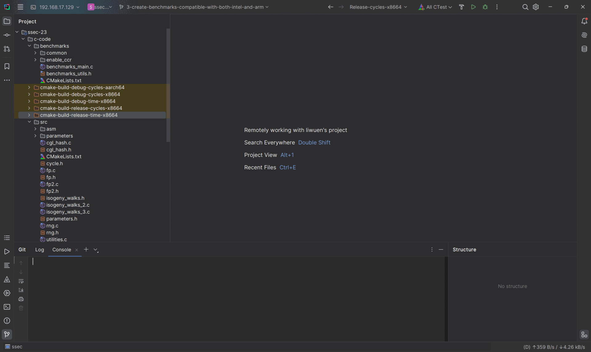

# Let us walk on the 3-isogeny graph: CLion Setup

This project uses `cmake`. In case it is desired to use a specialized IDE like Clion, a stand-alone `cmake` build can be done as well, but the instructions have to be run manually.

To set up the environment, in clion, create four different cmake profiles with the following instructions:

- Debug-cycles-x8664:
    - Build type: Use `Debug`.
    - Generator: Use `Unix Makefiles`.
    - CMake Options: Use `-G "Unix Makefiles" -DCMAKE_BUILD_TYPE=Debug -DBENCHMARKING=CYCLES -DARCHITECTURE=x8664`

- Release-cycles-x8664:
    - Build type: Use `Release`.
    - Generator: Use `Unix Makefiles`.
    - CMake Options: Use `-G "Unix Makefiles" -DCMAKE_BUILD_TYPE=Release -DBENCHMARKING=CYCLES -DARCHITECTURE=x8664`

- Debug-time-x8664:
    - Build type: Use `Debug`.
    - Generator: Use `Unix Makefiles`.
    - CMake Options: Use `-G "Unix Makefiles" -DCMAKE_BUILD_TYPE=Debug -DBENCHMARKING=TIME -DARCHITECTURE=x8664`

- Release-cycles-x8664:
    - Build type: Use `Release`.
    - Generator: Use `Unix Makefiles`.
    - CMake Options: Use `-G "Unix Makefiles" -DCMAKE_BUILD_TYPE=Release -DBENCHMARKING=TIME -DARCHITECTURE=x8664`

Please refer to the figure below for clarification.

