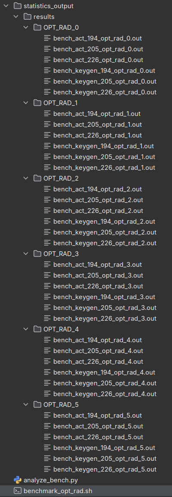
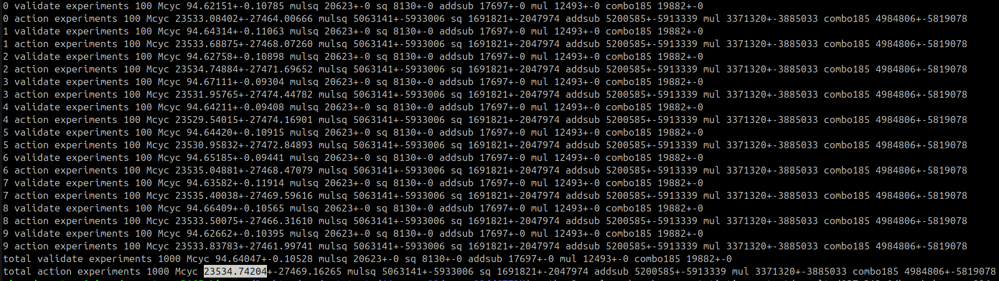

# dCTIDH modified version

This repository contains auxiliary material taken from the [dCTIDH repository](https://github.com/PaZeZeVaAt/dCTIDH).
In particular, we list the modifications performed on the code below.

- Modified files:

  - `dCTIDH/CMakeLists.txt`: added flag option for using radical 3-isogenies.
  - `dCTIDH/main/CMakeLists.txt`: added flag option for using radical 3-isogenies.
  - `dCTIDH/main/ctidh.c`: added benchmark for the key generation (keygen).
  - `dCTIDH/src/CMakeLists.txt`: added flag option for using radical 3-isogenies.
  - `dCTIDH/src/CMakeLists.txt`: added isogeny_walks_3fp to compilation (line 197).
  - `dCTIDH/src/CTIDH/ctidh.c`: removed used of (at most) the fifth smallest isogeny degrees (3,5,7,11,13).
  - `dCTIDH/src/CTIDH/ctidh.c`: Added radical 3-isogeny's call (line 387-389).
  - `dCTIDH/src/CTIDH/ctidh.h`: added radical 3-isogeny data in the private key
  - `dCTIDH/src/CTIDH/isogeny_walks.h`: added radical 3-isogeny header
  - `dCTIDH/src/CTIDH/isogeny_walks_3_fp.c`: added radical 3-isogeny source code
  - `dCTIDH/src/common/primes.h`: updated exponent of two.
  - `dCTIDH/src/common/primes2047m1l226.c`: removed used of (at most) the fifth smallest isogeny degrees (3,5,7,11,13).
  - `dCTIDH/src/common/primes2047m4l205.c`: removed used of (at most) the fifth smallest isogeny degrees (3,5,7,11,13).
  - `dCTIDH/src/common/primes2047m6l194.c`: removed used of (at most) the fifth smallest isogeny degrees (3,5,7,11,13).
  - `dCTIDH/src/common/skgen.c`: added radical 3-isogeny.
  - `dCTIDH/src/common/validate.c`: updated according to remove (at most) the fifth smallest isogeny degrees (3,5,7,11,13)..

- New files:

  - `dCTIDH/src/CTIDH/isogeny_walks_3_fp.c`: added radical 3-isogeny layer.
  - `dCTIDH/src/CTIDH/isogeny_walks.h`: added namespace for the radical 3-isogeny layer.

In addition, this repository includes the corresponding implementation of projective radical 3-isogenies.

## Building

Use the flag option `-DOPT_RAD=ARG_RAD` with `ARG_RAD=[0/1/2/3/4/5]` to employ radical 3-isogenies. The code takes `ARG_RAD=0` by default.

```sh
# Only necessary first time (generally)
rm -rf build/
mkdir build && cd build
cmake .. -DOPT_RAD=5

# Building
make
```
This builds the executables for 3 versions:

- 2047m1l226 
- 2047m4l205
- 2047m6l194

## Benchmarking

```sh
usage (when in /build/main) : 	
    ./ctidh-2047m1l226.main				// for a quick test
    ./ctidh-2047m1l226.main -bact [number of runs]	// run benchmark for the action
    ./ctidh-2047m1l226.main -bkey [number of runs]	// run benchmark for the action
```

The benchmarks can be analyzed using the `analyze_bench.py` script:

```sh
$ ./build/main/ctidh-2047m1l226.main -bkey 500 > bench_keygen.out
$ python3 analyze_bench.py < bench_action.out 
```

## Benchmarking script

To run the benchmarking script and generate the related statistics, please run

```bash
ssec-23/dCTIDH$ mkdir statistics_output
ssec-23/dCTIDH$ sudo bash benchmark_opt_rad.sh 
```

This will generate a tree structure like the one shown below



To run the statistics, for a particular `OPT_RAD`, execute

```bash
ssec-23/dCTIDH$ python3 analyze_bench.py < statistics_output/<RESULTS_FOLDER>/OPT_RAD_<SELECTED_OPT_RAD>/bench_<KEYGEN_OR_ACT>_<dCTIDH_PRIME>_opt_rad_<SELECTED_OPT_RAD>.out
```
Examples:
```bash
ssec-23/dCTIDH$ python3 analyze_bench.py < statistics_output/results/OPT_RAD_0/bench_keygen_226_opt_rad_0.out
ssec-23/dCTIDH$ python3 analyze_bench.py < statistics_output/results/OPT_RAD_1/bench_act_205_opt_rad_1.out
```
This will output the results like the following



where the highlighted number is the desired statistical result.

## Constant-time Check

If `DENABLE_CT_TESTING=ON`, `checkct` versions of the executable are created for all versions, which can be validated with `valgrind`.

For example, to validate that ctidh-2047m6l194 is constant-time:

```sh 
valgrind ./main/checkct-2047m6l194.main
```

## Licenses

For the third-party code see their licenses:

- [dCTIDH](https://github.com/PaZeZeVaAt/dCTIDH): [https://github.com/PaZeZeVaAt/dCTIDH/blob/main/LICENSE](https://github.com/PaZeZeVaAt/dCTIDH/blob/main/LICENSE)
- [CTIDH](http://ctidh.isogeny.org/): [http://ctidh.isogeny.org/high-ctidh-20210523/AUTHORS.md.html](http://ctidh.isogeny.org/high-ctidh-20210523/AUTHORS.md.html)
- [dCSIDH](https://github.com/kemtls-secsidh/code): [https://github.com/kemtls-secsidh/code/blob/main/LICENSE.md](https://github.com/kemtls-secsidh/code/blob/main/LICENSE.md)
- [sibc](https://github.com/JJChiDguez/sibc): [https://github.com/JJChiDguez/sibc/blob/master/LICENSE](https://github.com/JJChiDguez/sibc/blob/master/LICENSE)
